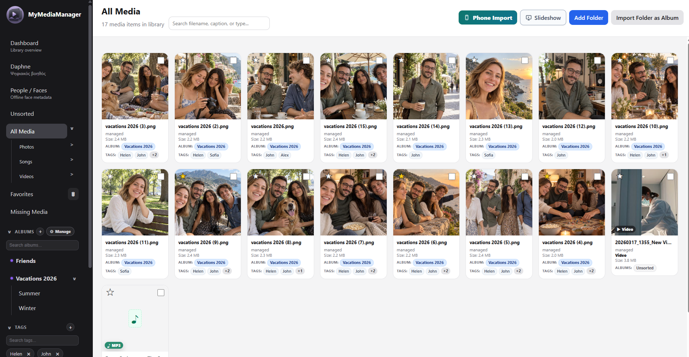
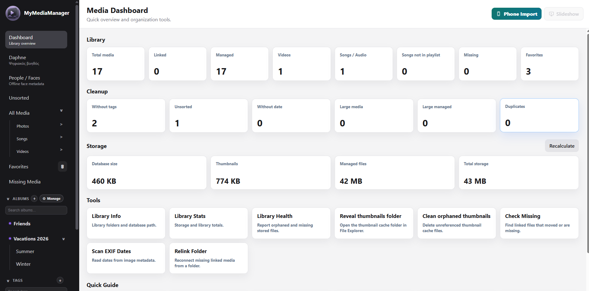
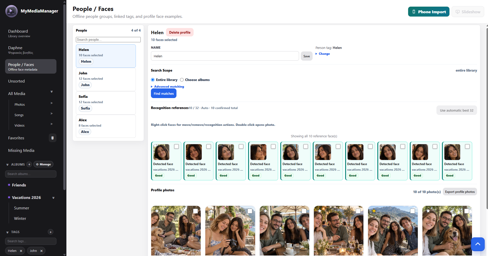
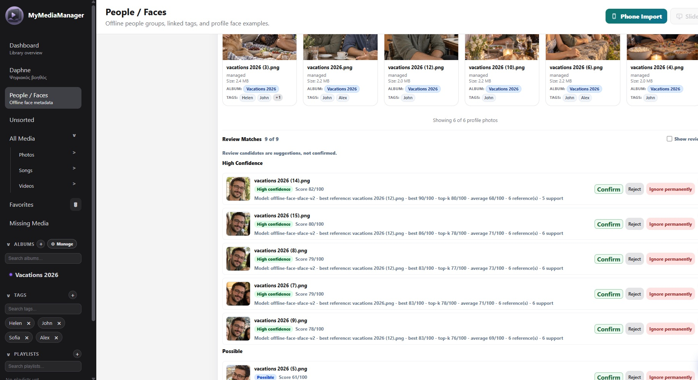
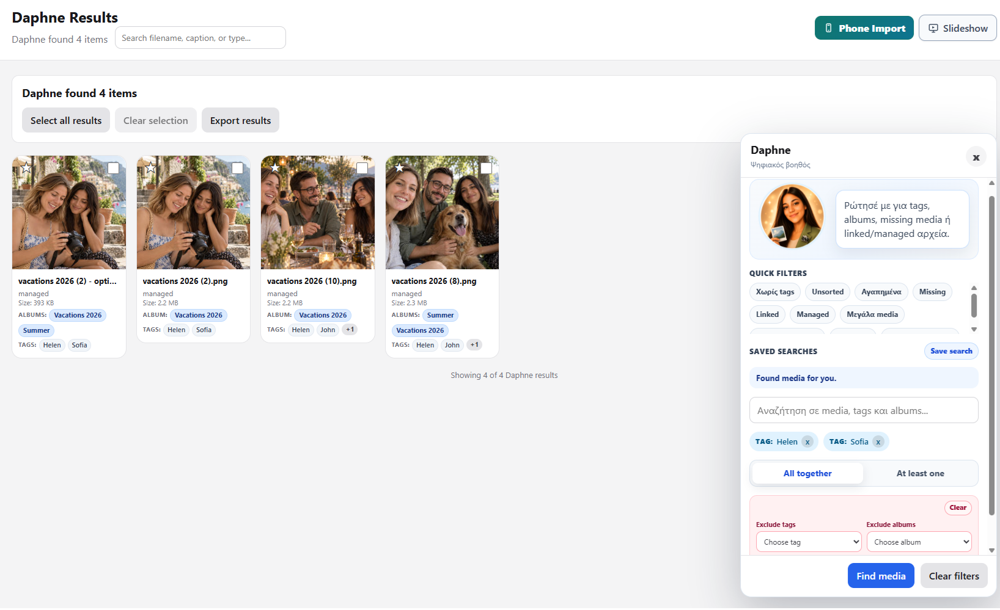
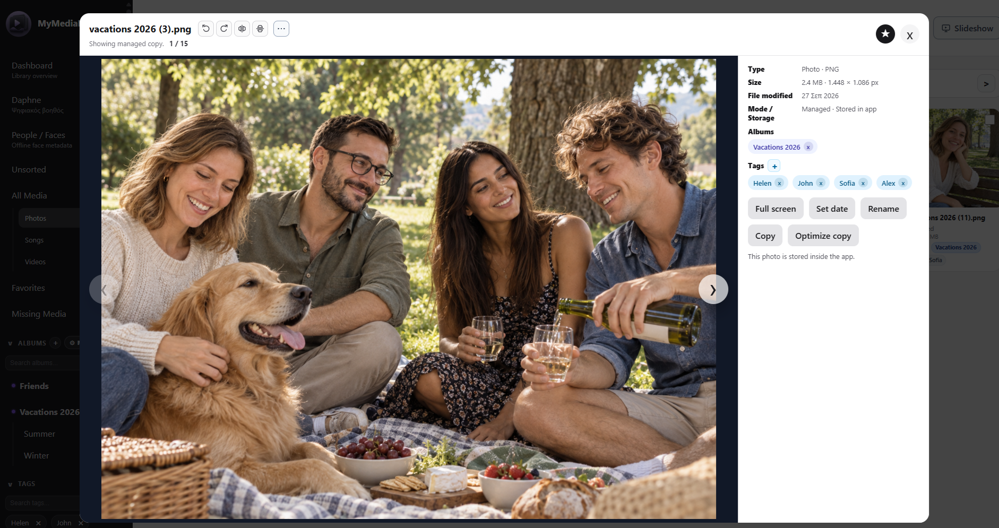
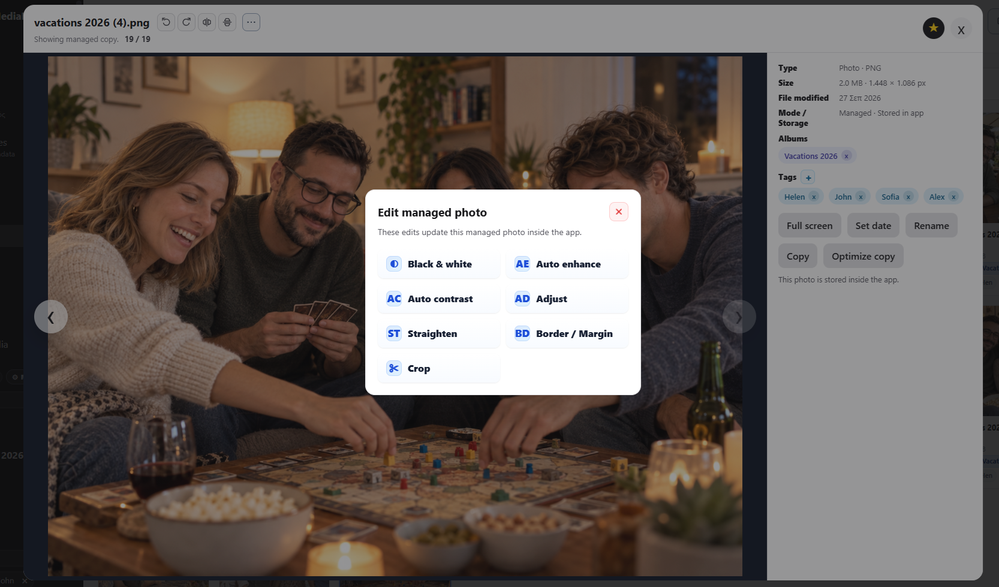
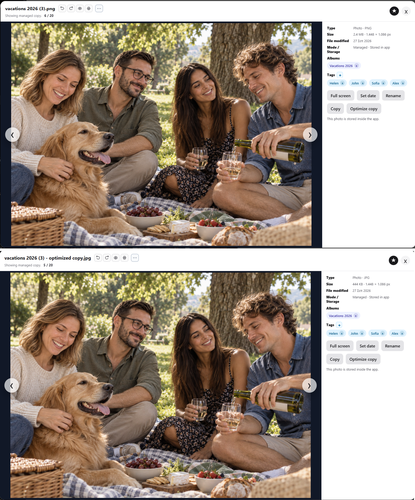
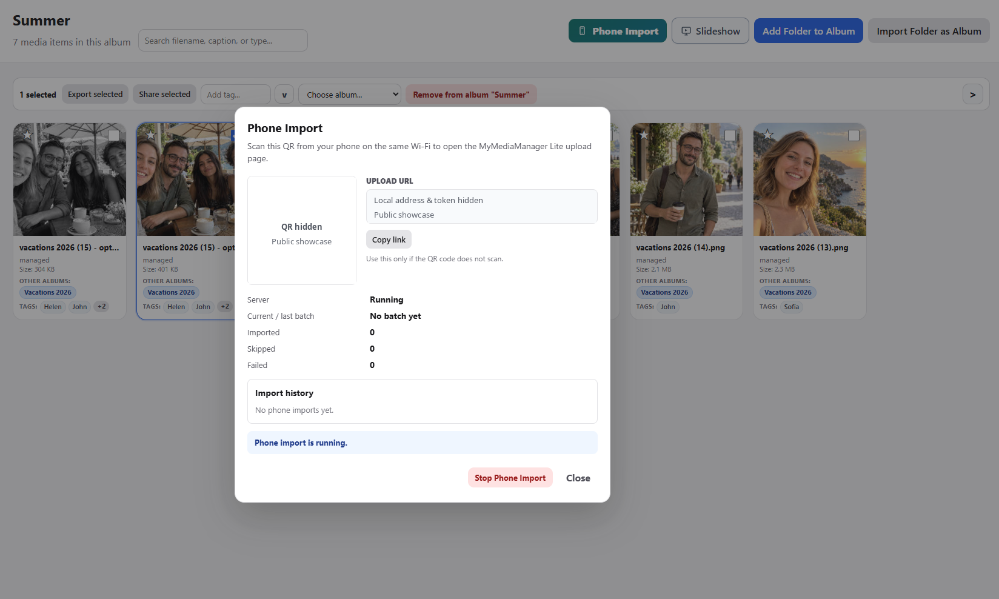
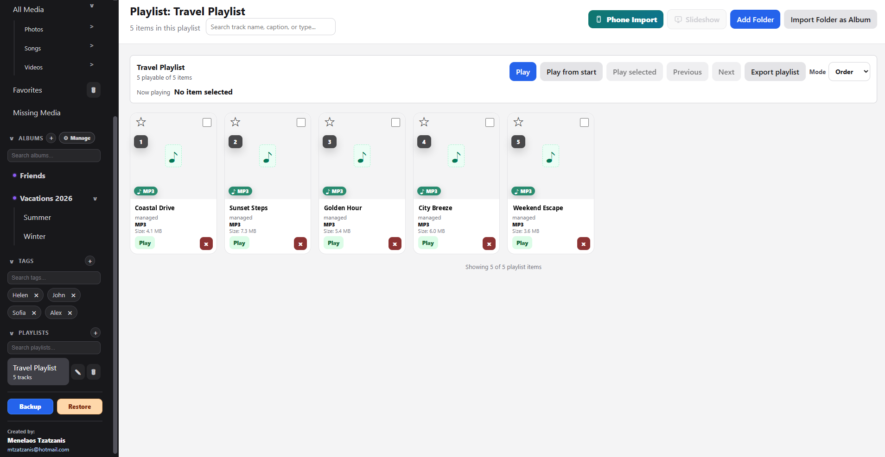

# MyMediaManager

**Local-first Windows desktop media manager for organizing photos, videos and audio in one structured library.**

[English](README.md) · [Ελληνικά](README_GR.md)

---

## Overview

MyMediaManager is a Windows desktop application designed to organize personal photo, video and audio collections without requiring a cloud-based media library.

It brings together media browsing, albums, nested organization, tags, favorites, people profiles, assisted face recognition, advanced search, phone import, photo tools, playlists, slideshow, export, backup and library-maintenance tools in one desktop environment.

A central part of the application is flexibility in how existing files are handled:

- **Linked media** can remain in their original folders
- **Managed media** can be copied into the application's own library
- Existing folder structures can be imported as albums
- The same media item can belong to multiple albums without requiring a separate physical copy for every album
- Tags can provide an additional layer of organization independently from folders and albums

Core library management, search, face matching and media processing are designed to run locally on the Windows computer.

> **Portfolio showcase:** This public repository presents the application and its interface. The production source code is maintained privately and is not published here.

---

## Media Library

MyMediaManager provides a visual library for photos, videos and audio files.

Media can be organized through:

- Albums
- Nested albums
- Tags
- Favorites
- Media type
- People profiles
- Search and filtering
- Unsorted and missing-media views

The same item can be associated with multiple albums and tags, allowing the library structure to remain flexible without having to duplicate the file for every category.



---

## Import Existing Folders as Albums

Existing folders can be imported directly into the library as albums.

When a folder structure already contains meaningful organization, MyMediaManager can use the folder and subfolder names to create or reuse a corresponding album hierarchy.

For example:

```text
Vacations 2026
├── Summer
└── Winter
```

can become a matching album structure inside the application.

This makes it possible to bring an existing media collection into the application without manually recreating every album from the beginning.

---

## Linked & Managed Media

MyMediaManager supports two different approaches to local files.

### Linked

Linked media remains in its existing location on the computer or connected storage.

This is useful when the user wants to keep an established folder structure and avoid creating another managed copy of the original file.

If a linked file is later moved or becomes unavailable, the application includes missing-media detection and relinking tools.

### Managed

Managed media is stored inside the application's own library structure.

This approach allows the application to manage the stored copy directly and enables workflows such as managed-photo editing and optimized copies.

The Dashboard keeps the two storage modes visible as separate library totals.

---

## Dashboard & Library Health

The Dashboard provides an overview of the current library together with maintenance and storage tools.

Available information and actions include:

- Total media
- Linked and Managed totals
- Video and audio counts
- Favorites
- Missing media
- Untagged and unsorted media
- Duplicate information
- Database size
- Thumbnail storage
- Managed-file storage
- Total library storage
- Library Health
- Missing-file checks
- Relinking
- EXIF date scanning
- Orphaned-thumbnail cleanup



---

## People & Faces

MyMediaManager includes local tools for organizing photos around people.

A person profile can be connected to a tag, allowing confirmed face matches to help apply that person's tag to the corresponding photos.

This turns face matching into a practical organization workflow rather than only a visual face-detection feature.

Profiles can contain multiple reference faces taken from the user's own library.



---

## Assisted Offline Face Recognition

Face recognition is designed to assist the user rather than make final decisions automatically.

The application can search the local library for possible matches to an existing person profile and group suggestions by confidence.

The user can then:

- Confirm a suggestion
- Reject it
- Ignore it permanently
- Review possible matches
- Select recognition references
- Search the entire library or selected albums

Confirmed matches can apply the person's linked tag to the relevant photo, making the creation of organized people-based collections substantially faster.



Face matching is **not expected to be perfect**. Suggestions may be incorrect or may miss a person, so the workflow deliberately keeps confirmation under the user's control.

Recognition operates against profiles created inside the user's own library. It is not an Internet identity-search service.

---

## Daphne — Library Search Assistant

Daphne provides a focused way to build more advanced searches across the local library.

Search conditions can include combinations such as:

- Specific tags
- Specific albums
- Excluded tags
- Excluded albums
- Match all conditions
- Match at least one condition
- Media type
- Year
- File size
- Library state
- Saved searches

For example, the user can find media tagged with **Helen** and **Sofia**, while excluding anything tagged with **Alex**.

The complete result set can then be selected or exported directly.



Daphne works with the information stored in the local media library. It is intended as a practical search and organization assistant rather than a general-purpose cloud chatbot.

---

## Photo Viewer

The integrated viewer keeps the media itself together with useful library information.

Depending on the media type and storage mode, the viewer can provide:

- Full-size viewing
- Previous / next navigation
- Zoom
- Rotation
- Flip
- Full screen
- Favorite status
- File information
- Dimensions and size
- Albums
- Tags
- Date management
- Rename
- Copy
- Managed-photo actions



---

## Managed Photo Editing

Supported Managed photos can be edited directly through the application.

Available tools include:

- Black & white
- Auto enhance
- Auto contrast
- Brightness, contrast and other adjustments
- Saturation
- Sharpness
- Straighten
- Border / margin
- Crop
- Rotate
- Flip



The exact behavior depends on the selected editing operation. Not every editing workflow should be considered non-destructive.

---

## Optimized Copies

MyMediaManager can create a separate optimized JPEG copy of a Managed image.

The workflow can use resizing and JPEG quality settings to produce a smaller file while preserving the original item as a separate library entry.

Relevant album and tag relationships can also be carried into the new copy.

The example below shows one specific image where a **2.4 MB PNG** produced a **444 KB JPEG** optimized copy.



File-size reduction depends on the source image and selected settings; this example is not a guaranteed compression ratio for every file.

---

## Phone Import

Photos, videos and audio can be transferred from a phone through a temporary local-network upload page.

The desktop application starts the import session and provides a QR code that can be opened from a phone on the same trusted Wi-Fi network.

Before uploading, the mobile workflow can support organization choices such as:

- Selecting an existing album
- Creating a new album
- Selecting existing tags
- Creating new tags
- Choosing the media to upload
- Using supported import-quality options

This means media can arrive in the desktop library already associated with useful organization instead of always being sorted afterwards.



Phone Import operates through the local network and browser. It is not presented as a separate native mobile application or cloud-storage service.

Sensitive local connection information has been hidden in the portfolio screenshot.

---

## Audio & Playlists

MyMediaManager also includes audio-library and playlist functionality.

Users can:

- Organize audio files
- Create playlists
- Control playlist order
- Play individual tracks
- Play a playlist from the beginning
- Move through playlist items
- Use ordered or alternative playback modes
- Export a playlist

When a playlist is exported, numbered filenames can be used to preserve its intended order outside the application.



---

## Slideshow

Photos and supported videos can be viewed through the integrated slideshow.

Slideshow options include:

- Configurable media-change interval
- Current or alternative ordering
- Repeat from beginning
- Manual previous / next navigation
- Full-screen presentation

Audio playback from the application's player can continue while photo slides are displayed. When video playback begins, the audio-player behavior is handled separately to avoid competing playback.


---

## Export & Sharing

The application includes several ways to take selected media back out of the library.

Depending on the workflow, users can export:

- Selected media
- Search results
- Album-related selections
- Person-profile photos
- Playlist content
- Files to a normal folder
- ZIP packages

Windows sharing functionality is also supported for relevant workflows.

The purpose is to keep organization inside the application without trapping the media inside it.

---

## Backup & Restore

MyMediaManager includes local Backup and Restore functionality.

A library backup can include:

- Database snapshot
- Managed media
- Thumbnails
- Backup metadata / manifest

Restore includes validation and confirmation before replacing the active library.

Because **Linked** media remains outside the Managed library, the original external Linked files are not automatically copied into the application backup. Their library references are retained, but the user remains responsible for backing up the original files themselves.

---

## Local-First Design

MyMediaManager is designed around local media ownership and local processing.

Core application functionality does not depend on:

- A cloud media database
- A mandatory cloud account
- A remote recognition service
- Continuous Internet connectivity

Normal library data is stored locally.

Face detection and matching operate locally using the application's Windows and bundled recognition components.

Some explicitly selected sharing workflows may open or use external services, but these are separate user-initiated actions rather than a requirement for normal library operation.

---

## Technology

MyMediaManager is built using:

- **Tauri 2**
- **React**
- **TypeScript**
- **Rust**
- **SQLite**
- **ONNX Runtime**
- **Windows Media Face Detection**
- Local image-processing tools
- Local video/media-processing tools
- Windows desktop packaging with NSIS

The Rust backend handles database operations, local files, imports, exports, backup and restore, media processing, phone-import services and other native functionality.

The interface is implemented with React and TypeScript inside the Tauri desktop environment.

---

## Performance & Reliability Approach

The application includes mechanisms intended to keep larger media libraries practical, including bounded queries, paging, virtualization and on-demand processing in relevant areas.

Development also includes extensive frontend and Rust regression-test coverage around areas such as:

- Imports
- Albums and tags
- Linked and Managed media
- People / Faces
- Recognition workflows
- Backup and Restore
- Bulk operations
- Phone Import
- Missing media
- Thumbnails
- Large-library behavior

These implementation choices describe the application's development approach and are not intended as benchmark claims against other media-management products.

---

## Product Direction

MyMediaManager is intended to provide more structure than browsing media directly through folders, while keeping the user's files and library under local control.

The goal is to connect several everyday media workflows:

**import → organize → find → review → edit → export**

without requiring the user to move every part of their personal collection into a mandatory cloud ecosystem.

It is designed as a broader media organizer rather than only a photo viewer, combining photos, videos and audio inside the same library.

---

## Demo & Privacy Note

The person profiles and principal photo-demo material shown in this repository were created specifically for the portfolio presentation and use fictional people.

Audio titles shown in the playlist screenshot were also changed for presentation purposes.

Sensitive Phone Import connection information has been removed from the public screenshot.

Some interface information, including the application author's contact information where visible, is genuine.

---

## Source Code

The full production source code of MyMediaManager is maintained privately.

This repository is intended solely as a **product showcase and portfolio presentation**, containing documentation and screenshots demonstrating the application's functionality.

The complete production source code, database files, bundled binaries, recognition models and private application data are not included in this public repository.

---

## Project Status

**Functional Windows desktop software project.**

MyMediaManager is a working media-management application and continues to receive product, usability and reliability improvements.

---

## Author

Designed and developed by **Menelaos Tzatzanis**.

© 2026 Menelaos Tzatzanis. All rights reserved.
